# LHS Course Guide for 10th Graders — 2026-2027

This guide covers all courses available to incoming 10th graders at Lehi High School, including courses specifically listed for 10th grade and those with no grade restriction. Each section includes a prerequisite/relationship diagram and detailed course descriptions.

> **Diagram Legend:**
> - Green nodes = **UVU Concurrent Enrollment** (college credit available)
> - Dashed gray nodes = upper-grade courses shown for planning (not available to 10th graders)
> - Arrows show prerequisite or recommended progression
> - Dotted arrows show recommended (not required) progressions

---

## Table of Contents

0. [Graduation Requirements Overview](#graduation-requirements-overview)
1. [Language Arts Core](#language-arts-core) — 4.0 cr required
2. [Language Arts Electives](#language-arts-electives)
3. [Math Core](#math-core) — 3.0 cr required
4. [Math Electives](#math-electives)
5. [Science Core](#science-core) — 3.0 cr required
6. [Science Electives](#science-electives)
7. [Social Studies](#social-studies) — 3.0 cr required
8. [World Languages](#world-languages)
9. [Fine Arts — Visual Arts](#fine-arts--visual-arts) — 1.5 cr required (combined)
10. [Fine Arts — Performing Arts](#fine-arts--performing-arts)
11. [Health & Fitness](#health--fitness) — 2.0 cr required
12. [Physical Education Electives](#physical-education-electives)
13. [CTE — Agriculture](#cte--agriculture) — 1.0 cr required (any CTE)
14. [CTE — Business & Marketing](#cte--business--marketing)
15. [CTE — Family & Consumer Sciences](#cte--family--consumer-sciences)
16. [CTE — Media & Technology](#cte--media--technology)
17. [CTE — Health Science](#cte--health-science)
18. [CTE — Engineering & Design](#cte--engineering--design)
19. [Digital Studies](#digital-studies) — 0.5 cr required
20. [General Electives](#general-electives)
21. [Quick Reference: UVU CE Courses](#quick-reference-all-uvu-concurrent-enrollment-courses-for-10th-graders)

---

## Graduation Requirements Overview

Alpine School District requires **28.0 total credits** for high school graduation. The chart below shows each requirement area, the credits needed, and what a typical student completes in 9th vs. 10th grade.

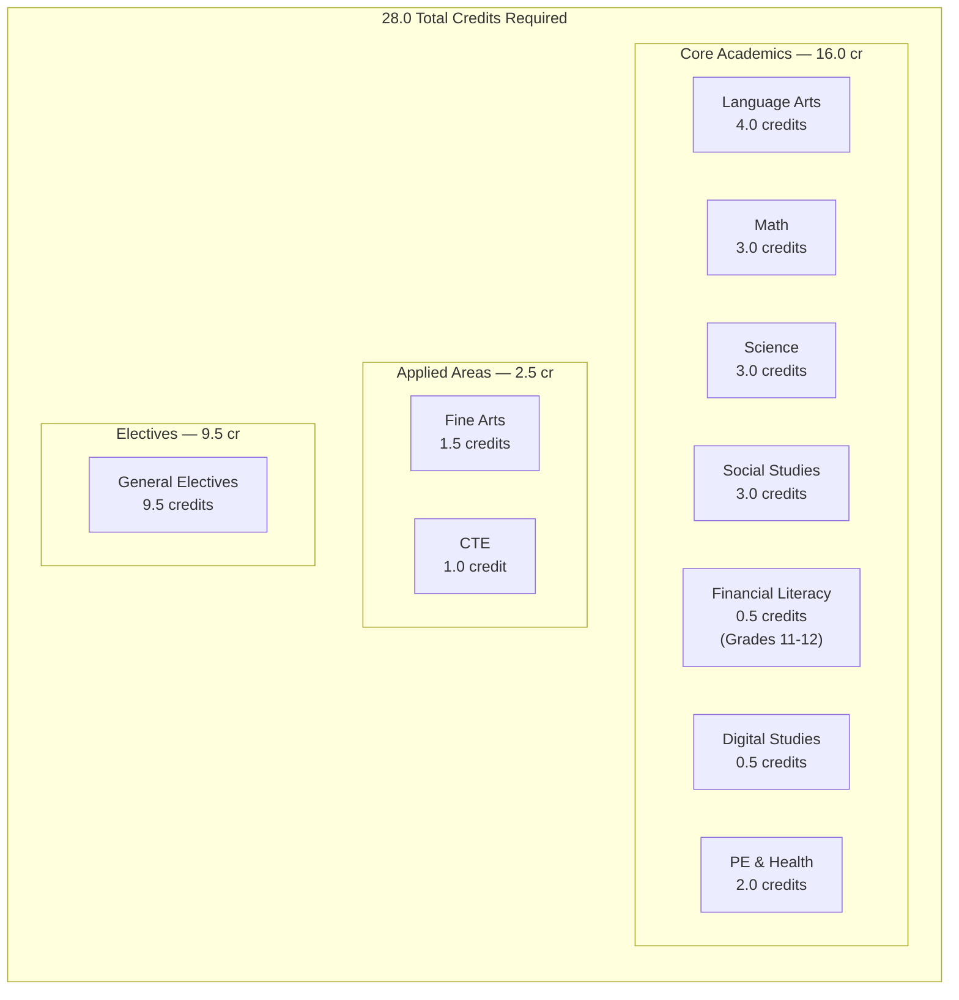

### Credit Requirements Detail

| Requirement Area | Credits | What Counts | Notes |
|---|:---:|---|---|
| **Language Arts** | **4.0** | 3 foundational courses + 1 applied/advanced | English 9 (9th), **English 10 (10th)**, English 11 (11th), + 1 elective or AP |
| **Math** | **3.0** | Secondary Math 1, 2, and 3 | Sec 3 can be replaced by an applied course with written parent request |
| **Science** | **3.0** | 2 foundational courses + 1 credit from any science area | Biology + Chemistry or Physics typically; 3rd credit from any science |
| **Social Studies** | **3.0** | 2.5 foundational + 0.5 elective | US History (1.0) + Gov & Citizenship (0.5) + World Civ (1.0) + 0.5 elective |
| **Fine Arts** | **1.5** | Visual arts, music, dance, theater, and/or media arts | Mix and match across fine arts areas |
| **PE & Health** | **2.0** | PE Skills/Fitness, Lifetime Activities, and Health | Fitness for Life (0.5) + Health (0.5) + 1.0 PE electives |
| **CTE** | **1.0** | Any CTE pathway area | Agriculture, Business, Engineering, Health Science, Media, etc. |
| **Digital Studies** | **0.5** | One of: Digital Business Apps, Computer Programming 1, Web Dev 1, etc. | Single semester course |
| **Financial Literacy** | **0.5** | General Financial Literacy (standard or CE) | Grades 11-12 only — plan ahead |
| **General Electives** | **9.5** | Any courses beyond requirements above | World Languages, extra CTE, extra arts, etc. |
| **TOTAL** | **28.0** | | |

### Typical 10th-Grade Credit Plan

A 10th grader typically earns **7.0 credits** per year (7 class periods). Below is what a sample schedule might look like, showing both required courses and elective flexibility.

| Period | Sample Schedule | Grad Requirement Fulfilled | Credits |
|:---:|---|---|:---:|
| 1 | English 10 or English 10 Honors | Language Arts (foundational) | 1.0 |
| 2 | Secondary Math 2 or Math 2 Extended | Math (foundational) | 1.0 |
| 3 | Biology, Chemistry, or Physics (+ CE option) | Science (foundational) | 1.0 |
| 4 | US History or AP US History CE | Social Studies (foundational) | 1.0 |
| 5 | Fine Arts course | Fine Arts | 0.5-1.0 |
| 6 | CTE, World Language, or PE elective | CTE / Elective | 0.5-1.0 |
| 7 | Health, Fitness for Life, or elective | PE & Health / Elective | 0.5-1.0 |

> **Tip for 10th graders:** You likely completed English 9, Sec Math 1, a science course, and some electives in 9th grade. In 10th grade, focus on completing your next core requirements (English 10, Sec Math 2, a second science, US History) while starting to fulfill Fine Arts, CTE, Digital Studies, and PE/Health requirements. Financial Literacy is available in 11th-12th grade only.

### Graduation Progress Tracker

Use this to track your progress across all four years:

| Requirement | Credits Needed | Typical 9th Grade | **Available 10th Grade** | Remaining for 11th-12th |
|---|:---:|---|---|---|
| Language Arts | 4.0 | English 9 (1.0) | **English 10 (1.0)** | English 11 (1.0) + elective (1.0) |
| Math | 3.0 | Sec Math 1 (1.0) | **Sec Math 2 (1.0)** | Sec Math 3 (1.0) |
| Science | 3.0 | 1 course (1.0) | **1-2 courses (1.0-2.0)** | Remaining |
| Social Studies | 3.0 | World Civ (1.0) | **US History (1.0)** | Gov (0.5) + 0.5 elective |
| Fine Arts | 1.5 | 0-1.0 | **0.5-1.5** | Remaining |
| PE & Health | 2.0 | Fitness (0.5) | **Health (0.5) + PE elective (0.5)** | Remaining |
| CTE | 1.0 | 0-0.5 | **0.5-1.0** | Remaining |
| Digital Studies | 0.5 | 0-0.5 | **0.5 if not done** | — |
| Financial Literacy | 0.5 | — | *Not available* | 0.5 (11th-12th only) |
| General Electives | 9.5 | ~2.0 | **~2.0-3.0** | Remaining |

---

## Language Arts Core

> **Graduation Requirement:** 4.0 credits total (3 foundational + 1 applied/advanced). English 10 counts as your 2nd foundational credit. Full-year courses = 1.0 credit.

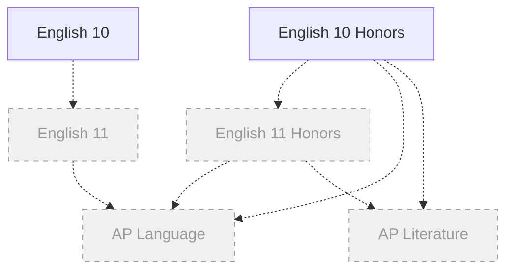

*Dashed/gray courses are 11th-12th grade only, shown for planning.*

### English 10

| | |
|---|---|
| **Graduation Requirement** | English 10 |
| **Course Length** | Full year |
| **Grade** | 10 |

This course takes a deeper dive into American literature, featuring classic and modern works across a variety of genres. Students focus on developing writing skills through four major projects: a literary analysis, an argumentative essay, a research paper, and a narrative piece. Along the way, students strengthen speaking, listening, and critical thinking skills.

### English 10 Honors

| | |
|---|---|
| **Graduation Requirement** | English 10 |
| **Course Length** | Full year |
| **Grade** | 10 |
| **Recommended** | English 9 Honors |

This accelerated course is designed to prepare college-bound students for AP Language and/or AP Literature courses. Class size will be limited. Students will continue an intensive emphasis on the writing process in the informational and functional areas, as well as the continued development of listening, viewing and speaking skills. Students will study all genres of American literature, reading classic as well as modern American authors. Students must maintain a B in order to stay in the class.

---

## Language Arts Electives

> **Graduation Requirement:** These courses count as your 4th Language Arts credit (the applied/advanced requirement) or as general electives. Some World Language courses at the 3+ level also fulfill Language Arts Elective credit.

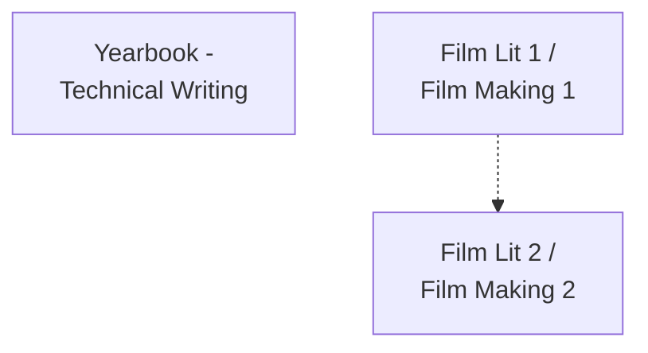

*Most Language Arts electives (Creative Writing, Dystopian Lit, Popular Lit, Sci-Fi/Fantasy Lit, Short Stories) are restricted to grades 11-12. The courses below are available to 10th graders.*

### Yearbook — Technical Writing

| | |
|---|---|
| **Graduation Requirement** | English Elective |
| **Course Length** | Full year |

This year-long course provides the study of and practice in gathering and analyzing information, interviewing, and note taking for the purpose of: (1) writing, (2) editing, and (3) publishing for the yearbook. Yearbook staff is responsible for recording the school year's history in word and photography. Writers will work with the photographers to layout photos and words in order to create a technically sound publication. This course includes instruction and practice in effective journalistic writing forms and techniques as well as layout, design, photojournalism, and typography.

### Film Literature 1 / Film Making 1

| | |
|---|---|
| **Graduation Requirement** | English Elective or Arts |
| **Course Length** | Semester |
| **Fee** | $20.00 |

Ever wondered how movies shape the world? Students will dive into the power of film as both an art form and a force for change. From the early days of cinema to modern blockbusters, students explore how movies reflect and impact history, culture, and society. Students will watch, analyze, discuss and write about iconic films, gaining a deeper understanding of storytelling and filmmaking techniques. Beyond watching movies, students will also create their own short films, write scripts, and work on creative projects.

### Film Literature 2 / Film Making 2

| | |
|---|---|
| **Graduation Requirement** | English Elective or Arts |
| **Course Length** | Semester |
| **Fee** | $20.00 |

This course explores how different film genres — from suspenseful film noir to laugh-out-loud comedies — use editing, music, lighting, and camera work to tell powerful stories. Students will analyze groundbreaking films from around the world, create their own projects, and even try their hand at podcasting. Film Lit 1 is not required.

---

## Math Core

> **Graduation Requirement:** 3.0 credits total — Secondary Math 1, 2, and 3. Sec Math 3 can be replaced with an applied course (e.g., Data Science, Math for Decision Making) with a written parent request. Full-year courses = 1.0 credit.

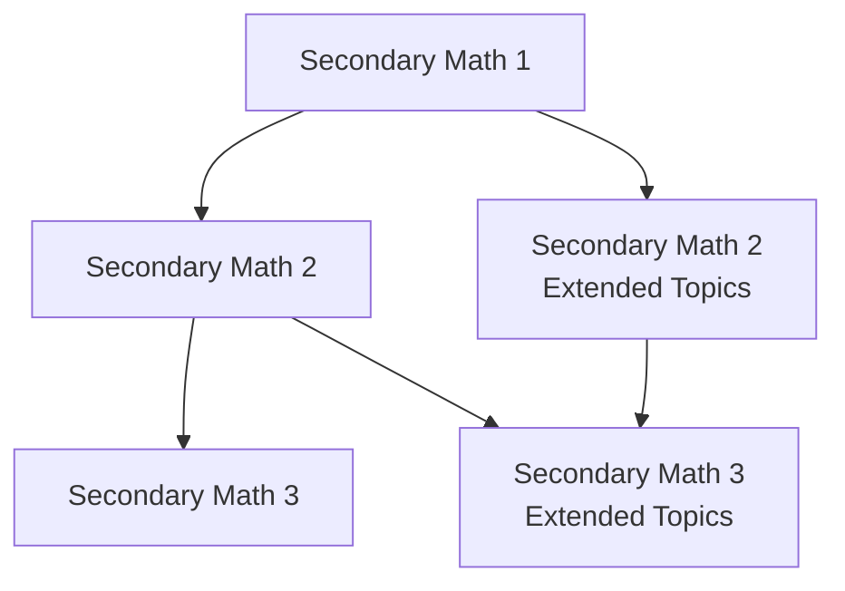

### Secondary Math 1

| | |
|---|---|
| **Graduation Requirement** | Math Core |
| **Course Length** | Full year |

Students will deepen and extend understanding of linear relationships, in part by contrasting with exponential phenomena, and in part by applying linear models to data that exhibit a linear trend. Students will also use the properties and theorems involving congruent figures to deepen and extend their understanding of geometric knowledge.

### Secondary Math 2

| | |
|---|---|
| **Graduation Requirement** | Math Core |
| **Course Length** | Full year |

Students will deepen their understanding of geometric properties to include proofs involving triangles, quadrilaterals, similarity, and circles. Students will also be introduced to trigonometric ratios. Significant time will be spent on analyzing quadratic functions and their applications. Students will work with polynomials, radicals, and complex numbers.

### Secondary Math 2 Extended Topics

| | |
|---|---|
| **Graduation Requirement** | Math Core |
| **Course Length** | Full year |
| **Grade** | 10 |

An accelerated course for students on the track toward AP Calculus. Primarily focuses on quadratic expressions, equations, and functions, including transformations and comparisons to linear and exponential models. Students extend the number system to complex numbers. The course continues with rigorous geometric proofs, similarity, right-triangle trigonometry, and circles. Extended topics include conic sections and calculating probabilities using permutations and combinations.

### Secondary Math 3

| | |
|---|---|
| **Graduation Requirement** | Math Core or Math Elective |
| **Course Length** | Full year |

Builds on Secondary Math 1 and 2, deepening students' understanding of algebra, functions, geometry, and statistics. Students will extend their knowledge of linear, quadratic, and exponential functions to include polynomial, rational, and logarithmic functions, apply trigonometry, and analyze data using probability and statistics.

### Secondary Math 3 Extended Topics

| | |
|---|---|
| **Graduation Requirement** | Math Core or Math Elective |
| **Course Length** | Full year |

Students will pull together and apply the learning from previous courses. They will apply methods from probability and statistics to draw inferences and conclusions from data. Students expand their repertoire of functions to include polynomial, rational, and radical functions. Honors students will also use probability to evaluate decisions, expand their knowledge of polynomial and trigonometric identities, and perform algebraic operations on rational expressions.

---

## Math Electives

> **Graduation Requirement:** Math electives count as general electives (or can replace Sec Math 3 with parent opt-out where noted). CE math courses can also fulfill the Opportunity Scholarship math requirement.

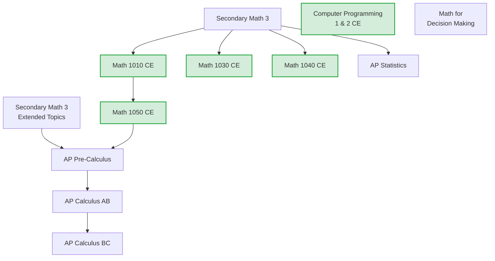

### Math 1010 CE

| | |
|---|---|
| **Graduation Requirement** | Math Elective |
| **Course Length** | Semester |
| **Prerequisite** | "C" average in Sec 1, 2, 3 or 19+ ACT Math |
| **UVU Concurrent Enrollment** | MAT 1010 |
| **Fee** | $5/credit tuition |

Expands and covers in more depth basic algebra concepts. Includes linear and quadratic equations and inequalities, polynomials and rational expressions, radical and exponential expressions and equations, complex numbers, systems of linear and nonlinear equations, functions, conic sections, and real world applications.

### Math 1030 CE

| | |
|---|---|
| **Graduation Requirement** | Math Elective |
| **Course Length** | Semester |
| **Prerequisite** | "C" average in Sec 1, 2, 3 or ACT 23 Math |
| **UVU Concurrent Enrollment** | MAT 1030 |
| **Opportunity Scholarship** | Fulfills Math Requirement |
| **Fee** | $5/credit tuition |

This math course shows how math helps solve real-life problems. Students learn about personal finance, growth rates, statistics, and probabilities, all while focusing on real-world situations. The goal is to help students think critically about numbers in the media and everyday life.

### Math 1040 CE

| | |
|---|---|
| **Graduation Requirement** | Math Elective |
| **Course Length** | Semester |
| **Prerequisite** | "C" average in Sec 1, 2, 3 or ACT 23 Math |
| **UVU Concurrent Enrollment** | MAT 1040 |
| **Opportunity Scholarship** | Fulfills Math Requirement |
| **Fee** | $5/credit tuition |

A hands-on, problem-solving course designed to build quantitative literacy through the lens of statistics. Students dive into key concepts like descriptive statistics, sampling techniques, and inferential methods, all while developing critical thinking skills.

### Math 1050 CE

| | |
|---|---|
| **Graduation Requirement** | Math Elective |
| **Course Length** | Semester |
| **Prerequisite** | "C" average in Sec 1, 2, 3 and ACT 23+ Math, or C+ in Math 1010 |
| **UVU Concurrent Enrollment** | MAT 1050 |
| **Opportunity Scholarship** | Fulfills Math Requirement |
| **Fee** | $5/credit tuition |

Precalculus covers College Algebra plus a complete course in Trigonometry. Trigonometry is the study of circular functions and triangles. Analytic Geometry is also part of this course. This class is designed to prepare students to take AP Calculus.

### AP Pre-Calculus

| | |
|---|---|
| **Graduation Requirement** | Math Elective |
| **Course Length** | Full year |
| **Optional Fee** | $99 AP test |

A year-long, college-level mathematics course designed to prepare students for calculus and other STEM-related disciplines. Focuses on developing deep conceptual understanding of functions as models of dynamic phenomena. Main topics: Polynomial and Rational Functions, Exponential and Logarithmic Functions, Trigonometric and Polar Functions, Functions Involving Parameters, Vectors, and Matrices.

### AP Calculus (AB)

| | |
|---|---|
| **Graduation Requirement** | Math Elective |
| **Course Length** | Full year |
| **Opportunity Scholarship** | Fulfills Math Requirement |
| **Optional Fee** | $99 AP test |

Equivalent to a first-semester college calculus course. Students tackle limits, derivatives, and integrals while discovering how calculus shapes the real world — from physics to economics to engineering. Students explore functions graphically, numerically, and algebraically.

### AP Calculus (BC)

| | |
|---|---|
| **Graduation Requirement** | Math Elective |
| **Course Length** | Full year |
| **Optional Fee** | $99 AP test |

Equivalent to both first and second-semester college calculus. Builds upon AP Calculus AB and extends to more advanced topics including infinite sequences and series. Multi-representational approach (graphical, numerical, analytical, and verbal) to problem-solving.

### AP Statistics

| | |
|---|---|
| **Graduation Requirement** | Math Elective |
| **Course Length** | Full year |
| **Opportunity Scholarship** | Fulfills Math Requirement |
| **Optional Fee** | $99 AP test |

Students learn how to collect, summarize, and analyze data to uncover patterns, spot trends, and make predictions. Covers probability, counting theory, simulations, and mathematical modeling. A graphing calculator (TI-83+ or TI-84 recommended) is required.

### Computer Programming 1 & 2 CE

| | |
|---|---|
| **Graduation Requirement** | CTE or Math Elective (with signed math opt out form) or Digital Studies |
| **Course Length** | Full year |
| **UVU Concurrent Enrollment** | CS 1400 (full year) |
| **Fee** | $5/credit tuition |

Year-long computer programming course covering software creation, game development, and business applications. Students learn Microsoft's C#, Kodu game development, and MonoGame Studio. Course fundamentals include conditionals, looping, methods, file manipulation, arrays, objects, and classes.

### Math for Decision Making

| | |
|---|---|
| **Graduation Requirement** | Math Elective |
| **Course Length** | Full year |
| **Requirement** | Parent signed math opt out form |

A practical course designed to improve numerical literacy. Students explore personal finance (taxes, budgeting, loans), data literacy (probability, statistical bias), and civic mathematics (voting systems, election fairness). The four quarters are independent — students may enter or exit at the start of any quarter.

---

## Science Core

> **Graduation Requirement:** 3.0 credits total — 2 foundational courses + 1 credit from any science area. Biology and Chemistry/Physics are typical foundational choices. CE science courses can also fulfill the Opportunity Scholarship science requirement.

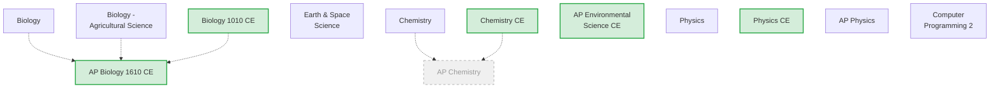

*AP Chemistry is grades 11-12 only (shown dashed for planning). All other science core courses are available to 10th graders.*

### Biology

| | |
|---|---|
| **Graduation Requirement** | Science Core or Science Elective |
| **Course Length** | Full year |
| **Fee** | $15 |

Covers cells, biochemistry, protein synthesis, genetics, evolution, and ecology. Students explore everything from how cells function to how organisms compete for survival in their ecosystems.

### Biology — Agricultural Science

| | |
|---|---|
| **Graduation Requirement** | CTE or Science Core or Science Elective |
| **Course Length** | Full year |
| **CTE Pathway** | Agriculture Mechanic Systems, Plant Science |

Same standards and objectives as Biology, with emphasis on agriculture. Students learn current technologies, methods, and changes in agricultural science.

### Biology 1010 CE

| | |
|---|---|
| **Graduation Requirement** | Science Core, Science Elective |
| **Course Length** | Full year |
| **UVU Concurrent Enrollment** | BIOL 1010 (3 credits) + BIOL 1015 lab (1 credit) |
| **Opportunity Scholarship** | Fulfills Science Requirement |
| **Fee** | $15 + $5/credit tuition |

Introduction to College Biology. Covers cell and molecular biology, genetics, diversity, evolution, and ecology. Lab component (BIOL 1015) includes hands-on experience with living organisms, microscope use, and scientific method application.

### AP Biology 1610 CE

| | |
|---|---|
| **Graduation Requirement** | Science Core, Science Elective |
| **Course Length** | Full year |
| **Recommended** | Previous biology background |
| **UVU Concurrent Enrollment** | BIOL 1610 (4 credits) + BIOL 1615 lab (1 credit) |
| **Opportunity Scholarship** | Fulfills Science Requirement |
| **Fee** | $10 + $5/credit tuition |
| **Optional Fee** | $99 AP test |

A third-level college biology course. For highly motivated students passionate about biology, especially those planning medical or science careers. The laboratory component develops hypothesis design, experimentation, data analysis, and critical/analytical thinking. AP credit varies by school.

### Earth & Space Science

| | |
|---|---|
| **Graduation Requirement** | Science Core, Science Elective |
| **Course Length** | Full year |

Investigates processes and mechanisms that formed our Earth, galaxy, and universe. Students develop models, analyze data, investigate Earth's interior, study water's effects on Earth materials, and explore sustainable resources. Includes labs, demonstrations, and research projects.

### Chemistry

| | |
|---|---|
| **Graduation Requirement** | Science Core or Science Elective |
| **Course Length** | Full year |
| **Recommended Prerequisite** | Secondary Math 2 |
| **Fee** | $15 |

Studies atoms, bonds (covalent, ionic, metallic), chemical reactions, balancing equations, equilibrium, stoichiometry, and nuclear chemistry. Includes hands-on lab work.

### Chemistry CE

| | |
|---|---|
| **Graduation Requirement** | Science Core, Science Elective |
| **Course Length** | Full year |
| **Recommended Prerequisite** | Secondary Math 2 |
| **UVU Concurrent Enrollment** | CHEM 1010 + CHEM 1115 lab |
| **Opportunity Scholarship** | Fulfills Science Requirement |
| **Fee** | $10 + $5/credit tuition |

Study of matter, its structure, properties and composition. Starting with atoms and working to large molecules. Covers the periodic table, states of matter, chemical bonding, solutions, and acid bases. Students will be involved in lab work.

### AP Environmental Science CE

| | |
|---|---|
| **Graduation Requirement** | Science Core, Science Elective |
| **Course Length** | Full year |
| **UVU Concurrent Enrollment** | ENVT 1110 |
| **Fee** | $10 + $5/credit tuition |
| **Optional Fee** | $99 AP test |

A hands-on, college-level course examining how natural systems work and how human activities impact the environment. Topics include ecosystems, population growth, energy resources, climate change, pollution, and sustainable practices. Prepares students for the AP exam and/or concurrent enrollment college credit.

### Physics

| | |
|---|---|
| **Graduation Requirement** | Science Core, Science Elective |
| **Course Length** | Full year |
| **CTE Pathway** | Engineering |

Study of the "rules" of nature. Focuses on understanding concepts of Physics more than calculations. Topics include science basics, properties of matter, forces, motion, energy, heat, electricity and magnetism, waves, sound, and light. Includes labs, demonstrations, and research projects.

### Physics CE

| | |
|---|---|
| **Graduation Requirement** | Science Core, Science Elective |
| **Course Length** | Full year |
| **Prerequisite** | Secondary Math 1 |
| **CTE Pathway** | Engineering |
| **UVU Concurrent Enrollment** | PHYS 1010 |
| **Opportunity Scholarship** | Fulfills Science Requirement |
| **Fee** | $10 + $5/credit tuition |

Concepts-first approach to physics. Topics include the universe, mechanics, properties of matter, heat, sound and light, electricity and magnetism, atomic and nuclear physics. Includes labs, demonstrations, and research projects.

### AP Physics

| | |
|---|---|
| **Graduation Requirement** | Science Core or Science Elective |
| **Course Length** | Full year |
| **Recommended Prerequisite** | Secondary Math 3 or currently enrolled |
| **CTE Pathway** | Engineering |
| **Opportunity Scholarship** | Fulfills Science Requirement |
| **Fee** | $10 + $5/credit tuition |
| **Optional Fee** | $99 AP test |

Equivalent to a first-year college physics class. Explores motion, forces, energy, and fluids through hands-on labs and teamwork. Strong focus on problem-solving and mathematical analysis. Prepares students for the AP Physics Exam.

### Computer Programming 2

| | |
|---|---|
| **Graduation Requirement** | Science Core or CTE |
| **Course Length** | Semester |
| **Prerequisite** | Computer Programming 1 |
| **Grades** | 10-12 |
| **CTE Pathway** | Programming & Software Development |

Introduces object-oriented programming concepts using Visual Basic.net, including tools, structure, syntax, and basic OOP design techniques. Students study classes, methods, fields, data types, control constructs, data I/O, exception handling, and class libraries.

---

## Science Electives

> **Graduation Requirement:** Science electives count toward your 3rd science credit or as general electives. Any science course (core or elective) can fulfill the 3rd credit.

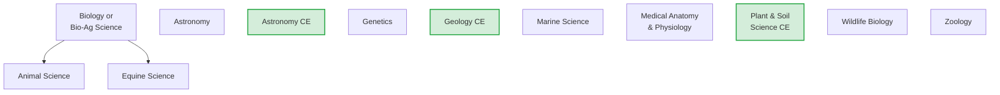

### Animal Science

| | |
|---|---|
| **Graduation Requirement** | CTE or Science Elective |
| **Course Length** | Full year |
| **Prerequisite** | Biology-Agricultural Science (for CTE pathway) or Biology |
| **CTE Pathway** | Animal & Veterinary Science |

Exposes students to a wide range of scientific principles: genetics, anatomy, physiology/nutrition, disease, pests, and management practices. Learning activities include classroom and laboratory experiences.

### Astronomy

| | |
|---|---|
| **Graduation Requirement** | Science Elective |
| **Course Length** | Semester |

An intro to astronomy giving students a broad understanding of the night sky, from ancient theories to modern discoveries. Covers planets, stars, black holes, rockets, constellations, and more. When possible, students use telescopes to observe celestial objects.

### Astronomy CE

| | |
|---|---|
| **Graduation Requirement** | Science Elective |
| **Course Length** | Full year |
| **UVU Concurrent Enrollment** | ASTR 1040 |
| **Opportunity Scholarship** | Fulfills Science Requirement |
| **Fee** | $10 + $5/credit tuition |

Introductory college-level astronomy course. Students are introduced through the eyes of ancient philosophers, scientists and mathematicians, then escalate through modern theories and discoveries. Each planet, stellar life cycles, constellations, comets, asteroids, black holes, and more are discussed in detail.

### Genetics

| | |
|---|---|
| **Graduation Requirement** | Science Elective |
| **Course Length** | Semester |
| **Fee** | $10 |

Covers Mendelian genetics (dominant/recessive), non-Mendelian genetics (incomplete dominance, co-dominance, epistasis), DNA, cloning, stem cells, and epigenetics.

### Equine Science

| | |
|---|---|
| **Graduation Requirement** | CTE or Science Elective |
| **Course Length** | Full year |
| **Prerequisite** | Biology-Agricultural Science or Biology |
| **CTE Pathway** | Animal & Veterinary Science |

Prepares students to care for horses and horse equipment; to train horses for various roles; and to manage horse training, breeding, and housing programs. Covers horse genetics, anatomy, physiology/nutrition, diseases, and pests. Includes classroom, laboratory, and field experiences.

### Geology CE

| | |
|---|---|
| **Graduation Requirement** | Science Elective |
| **Course Length** | Full year |
| **UVU Concurrent Enrollment** | GEO 1010 + GEO 1015 lab |
| **Opportunity Scholarship** | Fulfills Science Requirement |
| **Fee** | $10 + $5/credit tuition |

Study of the Earth, its systems, characteristics, and place in the solar system. Topics include space, earth structure, plate tectonics, minerals, rocks, geologic time, seismic activity, weathering, rivers, groundwater, glaciers, shorelines, deserts, ocean basins, and resources. Field trips to local geological sites are included.

### Marine Science

| | |
|---|---|
| **Graduation Requirement** | Science Elective |
| **Course Length** | Semester |

Designed for students interested in marine biology and oceanography. Topics include interrelationship of marine and terrestrial environments, geology of the oceans, marine organisms, ecology of coral reefs, and human impact on marine ecosystems. Includes examination of marine specimens.

### Medical Anatomy & Physiology

| | |
|---|---|
| **Graduation Requirement** | CTE, Science Elective |
| **Course Length** | Full year |
| **CTE Pathway** | Health Science |

Students examine each of the twelve body systems at a level of detail that will allow them to pass college-level courses. Includes dissections, medical career exploration, and field trips. Essential for students pursuing careers in medicine, dentistry, physical therapy, nursing, and more.

### Plant & Soil Science CE

| | |
|---|---|
| **Graduation Requirement** | CTE or Science Elective |
| **Course Length** | Full year |
| **CTE Pathway** | Plant Science |
| **Concurrent Enrollment** | Utah State University |
| **Fee** | $5/credit tuition |

Exposes students to plant, landscape, and greenhouse operation and management practices. Students learn about plant anatomy and production processes, preparing them to produce commercial plant species in natural and controlled environments.

### Wildlife Biology

| | |
|---|---|
| **Graduation Requirement** | Science Elective |
| **Course Length** | Semester |
| **Fee** | $10 |

Covers biomes, limiting factors, predator-prey relationships, symbiosis, taxonomy, invasive species, population measurement, and biodiversity. Students explore how human actions impact ecological balance.

### Zoology

| | |
|---|---|
| **Graduation Requirement** | Science Elective |
| **Course Length** | Semester |

Study of the diversity of animal life. Students analyze hierarchical organization of animal complexity and classification. Explores invertebrates through complex vertebrates, principles of natural selection, anatomical features, animal behavior, and global environmental trends threatening species survival.

---

## Social Studies

> **Graduation Requirement:** 3.0 credits total — 2.5 foundational (US History 1.0 + Gov & Citizenship 0.5 + World Civilizations 1.0) + 0.5 elective from any Social Studies area. US History is typically taken in 10th grade. Semester courses = 0.5 credit.

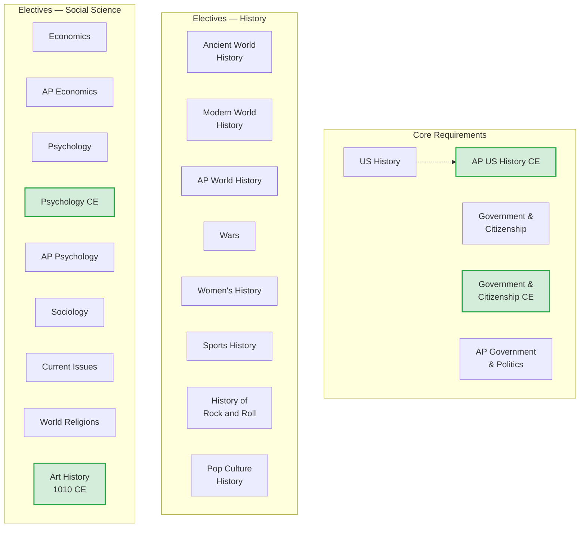

### US History

| | |
|---|---|
| **Graduation Requirement** | US History |
| **Course Length** | Full year |

Covers the history of the United States from 1865 to the present. Students study social, economic, and political developments, with emphasis on events, issues and important historical figures. Includes an in-depth study of the constitution.

### AP US History CE

| | |
|---|---|
| **Graduation Requirement** | US History |
| **Course Length** | Full year |
| **UVU Concurrent Enrollment** | HIST 1700 |
| **Fee** | $5/credit tuition |
| **Optional Fee** | $99 AP test |

College-level course covering American history, culture, and development from founding to present. Students can potentially earn up to 6 college credits (3 from UVU + 3 from AP). Expect college-level reading, writing, and critical thinking about democracy, civil rights, and cultural shifts.

### Government & Citizenship

| | |
|---|---|
| **Graduation Requirement** | Government & Citizenship |
| **Course Length** | Semester |

Gives students a general understanding of the government, political and legal systems of the United States and the responsibilities of being a good citizen.

### Government & Citizenship CE

| | |
|---|---|
| **Graduation Requirement** | Government & Citizenship |
| **Course Length** | Semester |
| **UVU Concurrent Enrollment** | POLS 1100 |
| **Fee** | $5/credit tuition |

Students learn the foundations of American government and how the political process works. Explores political structures (legislative, executive, judicial, and bureaucratic), behaviors, and processes. Students develop the ability to critically analyze current political issues.

### AP Government & Politics

| | |
|---|---|
| **Graduation Requirement** | Government & Citizenship and Social Studies Elective |
| **Course Length** | Full year |
| **Optional Fee** | $99 AP test |

In-depth study of the government, political and legal systems of the United States. Combines practical learning skills with varied activities. Students passing the AP exam with a score of 3 or above receive college credit.

### Ancient World History

| | |
|---|---|
| **Graduation Requirement** | World Civilizations or Social Studies Elective |
| **Course Length** | Semester |

Covers the progress of civilization from approximately 3500 B.C. to 500 A.D. Focuses on social, economic and political issues across ancient civilizations including Mesopotamia, Egypt, Greece, Rome, China, and India.

### Modern World History

| | |
|---|---|
| **Graduation Requirement** | World Civilizations or Social Studies Elective |
| **Course Length** | Semester |

Tracks world events from the 1200s A.D. through the Cold War Era, including Medieval times, Age of Exploration, Renaissance, Enlightenment, Age of Revolution, Age of Imperialism, and the World Wars Era.

### AP World History

| | |
|---|---|
| **Graduation Requirement** | Social Studies Elective |
| **Course Length** | Full year |
| **Optional Fee** | $99 AP test |

In-depth study of World History from 1000 C.E. to the present. Combines practical learning skills with essay writing and analysis. Students passing the AP exam with a score of 3 or above will likely receive college credit.

### Art History 1010 CE

| | |
|---|---|
| **Graduation Requirement** | Art or Social Studies Elective |
| **Course Length** | Semester |
| **UVU Concurrent Enrollment** | ART 1010 |
| **Fee** | $5/credit tuition |

Develops appreciation of the visual arts by investigating elements and principles of art, art criticism, art production, and the history of art. Students identify works of art and describe their significance in writing.

### Current Issues

| | |
|---|---|
| **Graduation Requirement** | Social Studies Elective |
| **Course Length** | Semester |

Students dive into the latest news and learn how to think critically about world events. Students explore different sources, discuss with classmates, and form informed opinions.

### Economics

| | |
|---|---|
| **Graduation Requirement** | Social Studies Elective |
| **Course Length** | Semester |

Dives into real-world economic issues. Students explore how the U.S. economy works, its role in the global market, and how to use economic principles for smarter financial decisions.

### AP Economics

| | |
|---|---|
| **Graduation Requirement** | Social Studies Elective |
| **Course Length** | Full year |
| **Optional Fee** | $99 AP test |

Full-year, college-level course covering both AP Microeconomics and AP Macroeconomics. Topics include supply and demand, market structures, economic indicators, fiscal and monetary policy, and international trade. Prepares students for both AP exams.

### History of Rock and Roll

| | |
|---|---|
| **Graduation Requirement** | Social Studies Elective |
| **Course Length** | Semester |

Students explore rock and roll music from its roots in blues, gospel, and country to modern alternative rock. Analyze key artists, influential albums, and major technological innovations through listening exercises, discussions, multimedia analysis, and creative projects.

### Pop Culture History

| | |
|---|---|
| **Graduation Requirement** | Social Studies Elective |
| **Course Length** | Semester |

Explores the history of music, film, television, fashion, and technology, revealing how cultural movements reflect and influence society. Through discussions, media analysis, and hands-on projects, students uncover the deeper meanings behind trends and social change.

### Psychology

| | |
|---|---|
| **Graduation Requirement** | Social Studies Elective |
| **Course Length** | Semester |
| **CTE Pathway** | Health Science |

Explores brain chemistry, personality, dreams, decision-making, and social influence through hands-on activities, real-world case studies, and experiments.

### Psychology CE

| | |
|---|---|
| **Graduation Requirement** | Social Studies Elective |
| **Course Length** | Semester |
| **CTE Pathway** | Health Science |
| **UVU Concurrent Enrollment** | PSY 1010 |
| **Fee** | $5/credit tuition |

College-level psychology course. Delves into brain function, cognition, mental health, social dynamics, and psychological research methods through in-depth discussions, case studies, and hands-on experiments.

### AP Psychology — Live Interactive

| | |
|---|---|
| **Graduation Requirement** | Social Studies Elective |
| **CTE Pathway** | Health Science |
| **Course Length** | Full year |
| **Optional Fee** | $99 AP test |

Taught in a facilitator-run classroom with a remote teacher. Examines theories of human and animal behavior, experimental research methodology, and inferential statistics. Areas include biological basis of behavior, sensation and perception, psychological disorders, consciousness, learning, personality, and ethics.

### Sports History

| | |
|---|---|
| **Graduation Requirement** | Social Studies Elective |
| **Course Length** | Semester |

Explores the evolution of sports and their impact on culture, society, and politics. Students analyze the influence of sports on race, gender, economics, and social change.

### Sociology

| | |
|---|---|
| **Graduation Requirement** | Social Studies Elective |
| **Course Length** | Semester |

Explores how society shapes who we are. Topics include social media, peer pressure, family life, inequality, culture, dating, values and social change.

### Wars

| | |
|---|---|
| **Graduation Requirement** | Social Studies Elective |
| **Course Length** | Semester |

In-depth look into World War I and World War II. Studies causes and effects, specific campaigns, and personal accounts of each war.

### Women's History

| | |
|---|---|
| **Graduation Requirement** | Social Studies Elective |
| **Course Length** | Semester |

Survey of women in America, the role of gender in American politics, and the experiences of women from different classes and races, from Egypt's first woman pharaoh to today's female leaders.

### World Religions

| | |
|---|---|
| **Graduation Requirement** | Social Studies Elective |
| **Course Length** | Semester |

Comparative course covering Christianity, Islam, Hinduism, Buddhism, Judaism, and a variety of lesser known religious beliefs and practices. Designed to develop religious tolerance and respect.

---

## World Languages

> **Graduation Requirement:** World Language courses at levels 1-2 count as **general electives**. At level 3 and above, they count as **Language Arts electives**, which can fulfill your 4th Language Arts credit. World languages are not a specific graduation requirement but are strongly recommended for college-bound students (most universities expect 2+ years).


### Spanish 1

| | |
|---|---|
| **Graduation Requirement** | General Elective |
| **Course Length** | Full year |

An introduction to the Spanish-speaking world. Students learn to navigate basic conversations, unlock Spanish grammar and written communication, and explore the vibrant cultures and customs of Spanish-speaking countries.

### Spanish 2

| | |
|---|---|
| **Graduation Requirement** | General Elective |
| **Course Length** | Full year |
| **Prerequisite** | Spanish 1 (recommended "C" or above) |

Continues expanding communication, writing, and comprehension skills. Students study culturally relevant topics and engage daily in active listening and conversational activities.

### Spanish 3 CE

| | |
|---|---|
| **Graduation Requirement** | Language Arts Elective |
| **Course Length** | Full year |
| **Prerequisite** | Spanish 2 with recommended "C" or higher |
| **UVU Concurrent Enrollment** | SPAN 1020 (4 credits) |
| **Fee** | $5/credit tuition |

Numerous opportunities to speak, read, and write in Spanish. Includes potential travel abroad opportunities and field trips. Students create a film in Spanish for a film festival competition.

### Spanish 4 CE

| | |
|---|---|
| **Graduation Requirement** | Language Arts Elective |
| **Course Length** | Full year |
| **Prerequisite** | Spanish 3 with recommended "C" or higher |
| **UVU Concurrent Enrollment** | SPAN 2010 (4 credits) |
| **Fee** | $5/credit tuition |

Reinforces advanced Spanish language skills. Combined with Spanish 3, students earn a total of 8 college credits. Includes film festival competition and potential travel abroad.

### AP Spanish

| | |
|---|---|
| **Graduation Requirement** | Language Arts Elective |
| **Course Length** | Full year |
| **Prerequisite** | Completion of Spanish 4 |
| **Optional Fee** | $99 AP test |

Prepares students for the AP Spanish Language and Culture Exam. Covers six thematic units: Families in Different Societies, Language and Culture's Influence on Identity, Beauty and Art, Science and Technology, Quality of Life, and Environmental and Political Challenges. Lessons conducted primarily in Spanish.

### French 1

| | |
|---|---|
| **Graduation Requirement** | General Elective |
| **Course Length** | Full year |

Students explore language and culture of French-speaking countries while building fundamental skills in speaking, listening, reading and writing. Five units: Introductions, Physical and Personality Descriptions, Pastimes, School and Family. Communication in class is primarily in French.

### French 2

| | |
|---|---|
| **Graduation Requirement** | General Elective |
| **Course Length** | Full year |
| **Prerequisite** | French 1 |

Five new units: Clothing and Weather, Home and Daily Routine, Healthy Eating, Hobbies and Interests, and Their Town. Communication in class is primarily in French.

### French 3 CE

| | |
|---|---|
| **Graduation Requirement** | Language Arts Elective |
| **Course Length** | Full year |
| **Prerequisite** | French 1 & 2 |
| **UVU Concurrent Enrollment** | FREN 1020 (4 credits) |
| **Fee** | $5/credit tuition |

Students improve speaking, listening, reading, and writing skills while diving into topics like travel, health, relationships, childhood, and French literature. Lots of real-world practice — asking and answering questions, forming sentences, and holding conversations — all in French.

### French 4 CE

| | |
|---|---|
| **Graduation Requirement** | Language Arts Elective |
| **Course Length** | Full year |
| **Prerequisite** | French 3 |
| **UVU Concurrent Enrollment** | FREN 2010 (4 credits) |
| **Fee** | $5/credit tuition |

Themes include education, beauty and art, war and peace, and technology. Students explore French literature, tell stories, share opinions, and hold more advanced conversations entirely in French.

### AP French

| | |
|---|---|
| **Graduation Requirement** | Language Arts Elective |
| **Course Length** | Full year |
| **Optional Fee** | $99 AP test |

College-level course preparing students for the AP French Language & Culture Exam. Topics include family life, identity, art, science, technology, contemporary life, and global issues. Students analyze texts, respond to emails, write persuasive essays, engage in conversations, and give cultural presentations — all in French.

### Japanese 1 — Live Interactive

| | |
|---|---|
| **Graduation Requirement** | General Elective |
| **Course Length** | Full year |
| **Grades** | 10-11 |
| **Fees** | ~$10-15 for field trips |

Taught in a facilitator-run classroom with a remote teacher. An introductory class in Japanese language and culture. Students learn hiragana, katakana, greetings and phrases, and basic grammar and sentence structure. Students must achieve mastery in hiragana and katakana to pass.

### Japanese 2 — Live Interactive

| | |
|---|---|
| **Graduation Requirement** | General Elective |
| **Course Length** | Full year |
| **Prerequisite** | Japanese 1 |
| **Fees** | ~$10-15 for field trips |

Continuation of Japanese 1. Students master katakana and hiragana and increase kanji knowledge. Students begin to communicate without formulated sentence patterns and can participate in normal everyday activities.

### American Sign Language 1

| | |
|---|---|
| **Graduation Requirement** | General Elective |
| **Course Length** | Full year |

Learn an interactive, fun, and visual language rooted in American Deaf Culture. Students learn 700+ vocabulary words, ASL grammar, Deaf culture, and communication skills. In-person attendance required. Accepted at all major colleges and universities.

### American Sign Language 1 — Live Interactive

| | |
|---|---|
| **Graduation Requirement** | General Elective |
| **Course Length** | Full year |

Taught in a facilitator-run classroom with a remote teacher. Teaches functional ASL for everyday interactions, including basic Deaf culture awareness.

### American Sign Language 2

| | |
|---|---|
| **Graduation Requirement** | General Elective |
| **Course Length** | Full year |
| **Prerequisite** | ASL 1 |

Continues from novice to intermediate level. Students learn 800+ additional vocabulary words, deeper ASL grammar, and Deaf culture. In-person attendance required. Accepted at all major colleges and universities.

---

## Fine Arts — Visual Arts

> **Graduation Requirement:** 1.5 credits total across all Fine Arts (visual arts, music, dance, theater, and/or media arts). Credits can be mixed across sub-areas. Semester courses = 0.5 credit; full-year courses = 1.0 credit.

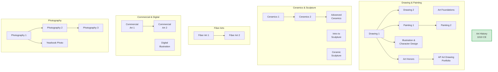

### Art Foundations

| | |
|---|---|
| **Graduation Requirement** | Art |
| **Course Length** | Semester |
| **Fee** | $35 |

Beginner art course exploring line, shape, color, and texture through fun projects and different materials (paint, color pencil, graphite).

### Drawing 1

| | |
|---|---|
| **Graduation Requirement** | Art |
| **Course Length** | Semester |
| **Fee** | Free (Graduation Pathways) |

Explores elements and principles of art. Students learn basic drawing skills in graphite, charcoal, ink, colored pencil, and pastel. Subjects include still life, observational drawing, perspective, portraiture, symbolism and personal expression.

### Drawing 2

| | |
|---|---|
| **Graduation Requirement** | Art |
| **Course Length** | Semester |
| **Recommended Prerequisite** | Drawing 1 |
| **Fee** | $35 |

Intermediate drawing course studying art techniques and styles from around the world. Media include graphite, pen and ink, charcoal, colored pencil, pastel, and marker. Covers figure drawing, advanced spatial drawing, creative processes, and composition.

### Illustration & Character Design

| | |
|---|---|
| **Graduation Requirement** | Art |
| **Course Length** | Semester |
| **Fee** | $35 |

For beginners and advanced artists alike. Explores visual storytelling through character design, storyboarding, and illustrating panels. Media include pencil, pen, colored pencil, marker, and more. Great for fans of comic strips, graphic novels, and manga.

### Painting 1

| | |
|---|---|
| **Graduation Requirement** | Art |
| **Course Length** | Semester |
| **Recommended Prerequisite** | Drawing 1 |
| **Fee** | $35 |

Focuses primarily on watercolor and acrylic painting to create realistic, architectural, and abstract art. No painting experience required.

### Painting 2

| | |
|---|---|
| **Graduation Requirement** | Art |
| **Course Length** | Semester |
| **Recommended Prerequisite** | Painting 1 |
| **Fee** | $35 |

Expands understanding of watercolor and acrylic paint and begins study of oil painting. Students explore new techniques, creative expression, and develop personal painting style.

### Art Honors

| | |
|---|---|
| **Graduation Requirement** | Art |
| **Course Length** | Full year |
| **Prerequisite** | Drawing & Painting or Teacher Approval |
| **Fee** | $35 |

Advanced course exploring a wide range of media to prepare for AP Art and Design. Topics include illustration, acrylic and oil painting, realism, abstraction, expressionism, and developing artistic inquiry.

### AP Art Drawing Portfolio

| | |
|---|---|
| **Graduation Requirement** | Art |
| **Course Length** | Full year |
| **Prerequisite** | Drawing and Painting or Teacher Approval |
| **Fee** | $35 |
| **Optional Fee** | $99 AP test |

Advanced studio art course for highly motivated students. Students develop a portfolio of college-level work for the AP Drawing or 2D Design portfolio exam. Requires significant time working outside of class.

### Ceramics 1

| | |
|---|---|
| **Graduation Requirement** | Art |
| **Course Length** | Semester |
| **Fee** | $40 |

Introduction to wheel throwing and hand-building techniques with surface design and glazing. No prior knowledge needed. In-person attendance required.

### Ceramics 2

| | |
|---|---|
| **Graduation Requirement** | Art |
| **Course Length** | Semester |
| **Prerequisite** | Ceramics 1 |
| **Fee** | $40 |

Strong focus on wheel throwing with creative surface design. In-person only.

### Advanced Ceramics

| | |
|---|---|
| **Graduation Requirement** | Art |
| **Course Length** | Semester |
| **Prerequisite** | Ceramics 1 & 2 |
| **Fee** | $40 |

Students develop their own ideas and push limits in clay. Refine wheel-throwing, hand-building, and learn new firing techniques. Option to develop an AP Art Portfolio. In-person attendance required.

### Intro to Sculpture

| | |
|---|---|
| **Graduation Requirement** | Art |
| **Course Length** | Semester |
| **Grades** | 10-12 |
| **Fee** | $35 (includes all materials) |

Hands-on exploration of three-dimensional art. Experiment with a variety of materials and sculpture techniques. Open to all skill levels.

### Ceramic Sculpture

| | |
|---|---|
| **Graduation Requirement** | Art |
| **Course Length** | Semester |
| **Grades** | 10-12 |
| **Fee** | $35 (includes all materials) |

Hands-on clay course covering coil, slab, and pinch techniques with texture, form, and surface design. No experience needed. In-person attendance required.

### Fiber Art 1

| | |
|---|---|
| **Graduation Requirement** | Art |
| **Course Length** | Semester |
| **Fee** | $35 |

Techniques include needle felting, basket weaving, embroidery in mixed media, and fabric art. Focus on detail work, time management, and creative process.

### Fiber Art 2

| | |
|---|---|
| **Graduation Requirement** | Art |
| **Course Length** | Semester |
| **Prerequisite** | Fiber Art 1 (Teacher approval required) |
| **Fee** | $35 |

Students create three original projects, working independently. Opportunity to enter work in local shows like the Springville Art Show.

### Commercial Art 1

| | |
|---|---|
| **Graduation Requirement** | Art or CTE |
| **Course Length** | Semester |
| **CTE Pathway** | Graphic Design & Communication |

Students create posters, logos, and digital graphics using Adobe Suite while building skills in typography, color, composition, and design principles.

### Commercial Art 2

| | |
|---|---|
| **Graduation Requirement** | Art or CTE |
| **Course Length** | Semester |
| **Recommended Prerequisite** | Commercial Art 1 |
| **CTE Pathway** | Graphic Design & Communication |

Intermediate course focusing on visual communication in illustration and/or graphic design. Training in software for concept design, layout, various techniques, and media.

### Digital Illustration

| | |
|---|---|
| **Graduation Requirement** | Art or CTE |
| **Course Length** | Semester |
| **CTE Pathway** | Graphic Design & Communication |

Drawing and painting in a digital environment using industry-standard software (Adobe Suite). Students create character designs, concept art, and finished illustrations while learning composition, color, perspective, and shading.

### Photography 1

| | |
|---|---|
| **Graduation Requirement** | Art or CTE |
| **Course Length** | Semester |
| **CTE Pathway** | Graphic Design & Communication |

Basics of using a camera, taking great pictures, and editing with Photoshop and Lightroom.

### Photography 2

| | |
|---|---|
| **Graduation Requirement** | Art or CTE |
| **Course Length** | Semester |
| **Recommended Prerequisite** | Photography 1 |
| **CTE Pathway** | Graphic Design & Communication |
| **Note** | Access to a film SLR camera and Digital camera required |

Real projects, creative experimentation, and building a photo collection. Learn to make pictures look more professional.

### Photography 3

| | |
|---|---|
| **Graduation Requirement** | Art or CTE |
| **Course Length** | Semester |
| **Recommended Prerequisite** | Photography 1 & 2 |
| **CTE Pathway** | Graphic Design & Communication |
| **Note** | Access to a film SLR camera and Digital camera required |

Advanced class: master camera skills, edit like a pro, work on real-world projects, and build a professional portfolio.

### Yearbook Photo

| | |
|---|---|
| **Graduation Requirement** | Art |
| **Course Length** | Semester |
| **Prerequisite** | Photo 1 and Teacher Approval |

Advanced camera techniques, composition, lighting, and action photography. Master photo editing, layout design, and visual storytelling for the yearbook.

---

## Fine Arts — Performing Arts

> **Graduation Requirement:** Performing arts courses (dance, drama, choir, orchestra, band, guitar) count toward the 1.5 Fine Arts credits. Some dance courses can alternatively count as PE electives.

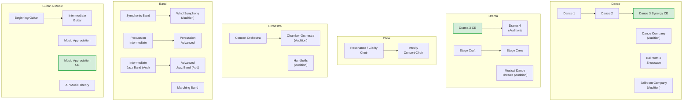

### Dance 1

| | |
|---|---|
| **Graduation Requirement** | Art or PE Elective |
| **Course Length** | Semester |
| **Grades** | 10-12 |
| **Fee** | $5 |
| **Note** | Dance clothes required |

Explores a variety of dance styles. Performance at end of semester required.

### Dance 2

| | |
|---|---|
| **Graduation Requirement** | Art or PE Elective |
| **Course Length** | Full year or Semester |
| **Grades** | 10-12 |
| **Prerequisite** | Dance 1 or Instructor Approval |
| **Fee** | $10 |
| **Note** | Dance clothes required |

Builds on Dance 1 with continued choreography, performance skills, and dance creation. Performance required.

### Dance 3 Synergy CE (Audition only)

| | |
|---|---|
| **Graduation Requirement** | Art or PE Elective |
| **Course Length** | Full year |
| **Grades** | 10-12 |
| **Prerequisite** | Audition or Instructor Approval |
| **UVU Concurrent Enrollment** | DANC 141R (optional) |
| **Fee** | $100 participation + $5/credit tuition. Uniform fees may apply. |

Focuses on building choreography skills, dance history, the role of dance artists in society, and continuing technique and performance development. Performance each semester required.

### Dance Company (Audition only)

| | |
|---|---|
| **Graduation Requirement** | Art or PE Elective |
| **Course Length** | Full year |
| **Grades** | 10-12 |
| **Prerequisite** | Audition only |
| **Fee** | $100 participation. Uniform fees may apply. |

Advanced dance company. Members increase in technical mastery, choreographic and improvisational skill, and performance artistry. Performs at halftimes, assemblies, and semester-end concerts. Extra-curricular rehearsals required.

### Ballroom 3 (Showcase Team)

| | |
|---|---|
| **Graduation Requirement** | Art or PE Elective |
| **Course Length** | Full year |
| **No prerequisites** | |

Performance-level class exploring essential ballroom dance elements — movement, technique, steps and partnering across a variety of dances. All levels welcome.

### Ballroom Company (Audition only)

| | |
|---|---|
| **Graduation Requirement** | Art or PE Elective |
| **Course Length** | Full year |
| **Prerequisite** | Audition only |
| **Fee** | $200 participation. Uniform fees may apply. |

Competitive performance company focused on mastering individual partner and formation routines in a variety of ballroom styles.

### Drama 3 CE

| | |
|---|---|
| **Graduation Requirement** | Art |
| **Course Length** | Full year |
| **UVU Concurrent Enrollment** | THEA 1013 (optional) |
| **Fee** | $40 + $5/credit tuition |

Hands-on course developing acting skills, playwriting, and theatrical performances. Includes character development, improvisation, Shakespeare, and ensemble work. Students perform in Night of Shakespeare and Night of One Acts, and compete at Region and State Drama Competitions.

### Drama 4 (Audition only)

| | |
|---|---|
| **Graduation Requirement** | Art |
| **Course Length** | Full year |
| **Fee** | $60. Uniform fees may apply. |

Advanced performance course: challenging acting techniques, ensemble work, experimental theatre, comedy and tragedy, Shakespearean performance, and cutting-edge acting styles. Students produce a mainstage play and compete at the Utah Shakespearean Festival and Region/State competitions.

### Musical Dance Theatre (Audition only)

| | |
|---|---|
| **Graduation Requirement** | Art |
| **Course Length** | Full year |
| **Fee** | $60. Uniform fees may apply. |

Students train in vocal performance, choreography, and acting techniques while preparing for the school's fall and spring musical productions.

### Stage Craft / Construction

| | |
|---|---|
| **Graduation Requirement** | Art |
| **Course Length** | Full year |
| **Fee** | Free (Graduation Pathways) |
| **Required after-school hours** | 1st semester: 20 hours; 2nd semester: 30 hours |

Introduces set design, lighting, sound, costume construction, and stage makeup. Students build and create props, costumes, and scenery.

### Stage Crew (Teacher approval required)

| | |
|---|---|
| **Graduation Requirement** | Art |
| **Course Length** | Full year |
| **Fee** | $10. Uniform fees may apply. |

Advanced technical theatre. Students design and implement technical elements for productions, gaining professional-level experience in lighting, sound, set design, and stage management. Students also run the school auditorium.

### Resonance Tenor/Bass Choir & Clarity Treble Choir

| | |
|---|---|
| **Graduation Requirement** | Art |
| **Course Length** | Full year or Semester |
| **Fee** | $50 participation. Uniform fees may apply. |

For sophomores with previous choir experience, or students of any grade with no choral experience who love to sing. Focuses on sound music fundamentals, singing well and in tune, and reading music. Concerts and district/state festival participation included.

### Varsity Concert Choir

| | |
|---|---|
| **Graduation Requirement** | Art |
| **Course Length** | Full year or Semester |
| **Prerequisite** | Choral Experience (Resonance & Clarity, or another music ensemble) |
| **Fee** | $50 participation. Uniform fees may apply. |

For singers pushing to the next level. Studies and performs a variety of music and styles. Emphasis on singing, sight reading, vowel placement, and teamwork. Includes overnight trip and fundraising.

### Concert Orchestra (Intermediate-Advanced)

| | |
|---|---|
| **Graduation Requirement** | Art |
| **Course Length** | Full year |
| **Grades** | 10-12 |
| **Fee** | $50 participation + $150 instrument rental if applicable. Uniform fees may apply. |

Performance-oriented ensemble. Basic and intermediate string skills with emphasis on performance. Orchestral music of various periods and styles with minimum five concerts per year. Non-auditioned but not beginning level.

### Chamber Orchestra Advanced (Audition only)

| | |
|---|---|
| **Graduation Requirement** | Art |
| **Course Length** | Full year |
| **Grades** | 10-12 |
| **Fee** | $50 participation + $150 instrument rental if applicable. Uniform fees may apply. |

Auditioned performance ensemble with advanced orchestral literature. Participates in district, region, and potentially state festivals. Small ensemble and full symphony rehearsals outside school day required.

### Handbells (Audition only)

| | |
|---|---|
| **Graduation Requirement** | Art |
| **Course Length** | Full year |
| **Fee** | $40 participation + $90 instrument rental. Uniform fees may apply. |

Students must read and have experience with Treble Clef (piano, percussion, or a treble/bass instrument). 5-6 performances per year. Possible tour to St. George in February.

### Beginning Guitar

| | |
|---|---|
| **Graduation Requirement** | Art |
| **Course Length** | Semester |
| **Fee** | $75 instrument rental if applicable |

Introduction to guitar. Students learn chords, melodies, standard notation, tablature, and basics of improvisation. Provide your own instrument recommended (classical nylon acoustic preferred).

### Intermediate Guitar

| | |
|---|---|
| **Graduation Requirement** | Art |
| **Course Length** | Semester |
| **Fee** | $75 instrument rental if applicable |

Expands knowledge of chords and playing abilities. Students should have basic chord and tablature skills. Continues standard notation and improvisation.

### Symphonic Band

| | |
|---|---|
| **Graduation Requirement** | Art |
| **Course Length** | Full year |
| **Fee** | $50 participation + $150 instrument rental if applicable. Uniform fees may apply. |

Intermediate band, primarily composed of sophomore students. Open enrollment with expected previous instrument experience. Required solo/ensemble festival and out-of-class rehearsals.

### Wind Symphony (Audition)

| | |
|---|---|
| **Graduation Requirement** | Art |
| **Course Length** | Full year |
| **Fee** | $50 participation + $150 instrument rental if applicable. Uniform fees may apply. |

Premiere concert band at Lehi High School. Sophomores may add upon successful audition. Required solo/ensemble festival, out-of-class rehearsals, and sectionals.

### Percussion Intermediate

| | |
|---|---|
| **Graduation Requirement** | Art |
| **Course Length** | Full year |
| **Fee** | $100 participation + $100 instrument rental. Uniform fees may apply. |

Requires at least one year of percussion or two years of piano experience. Develops well-rounded percussionists through drums, keyboards, and world percussion. Students also perform with Symphonic and Concert Bands.

### Percussion Advanced

| | |
|---|---|
| **Graduation Requirement** | Art |
| **Course Length** | Full year |
| **Fee** | $100 participation + $100 instrument rental. Uniform fees may apply. |

Top percussion students. Highly selective. Students perform as percussion ensemble and comprise the percussion section for Wind Symphony. Solo preparation required.

### Intermediate Jazz Band (Audition only)

| | |
|---|---|
| **Graduation Requirement** | Art |
| **Course Length** | Full year |
| **Prerequisite** | Audition |
| **Fee** | $50 participation + $150 instrument rental if applicable. Uniform fees may apply. |
| **Required** | Dual Enrollment with Wind Symphony, Symphonic Band, or Percussion class |

Intermediate jazz ensemble teaching a variety of jazz styles and improvisation in a big band setting. Also serves as pep band for basketball games.

### Advanced Jazz Band (Audition only)

| | |
|---|---|
| **Graduation Requirement** | Art |
| **Course Length** | Full year |
| **Prerequisite** | Audition |
| **Fee** | $50 participation + $150 instrument rental if applicable. Uniform fees may apply. |
| **Required** | Dual Enrollment with Wind Symphony, Symphonic Band, or Percussion class |

Premiere jazz ensemble. Limited to standard big band instrumentation (5 saxes, 4 trombones, 4 trumpets, rhythm section). Also serves as pep band.

### Marching Band

| | |
|---|---|
| **Graduation Requirement** | Art |
| **Course Length** | 1st Semester |
| **Fee** | Participation, Uniform and Other fees apply |
| **Note** | After-school class (registered but not during a school period) |
| **Required** | Dual Enrollment with Wind Symphony, Symphonic Band, Color Guard, or Percussion class |

Summer preparation begins early. Competes until early November. Plays at all home region football games with halftime shows. Competes in UMEA Marching Circuit. Annual tour to St. George for state championships.

### Music Appreciation

| | |
|---|---|
| **Graduation Requirement** | Art |
| **Course Length** | Semester |

Students learn music history from medieval ages onward, how to read music, and how to identify instruments.

### Music Appreciation CE

| | |
|---|---|
| **Graduation Requirement** | Art |
| **Course Length** | Semester |
| **UVU Concurrent Enrollment** | (course number varies) |
| **Fee** | $5/credit tuition |

Same content as Music Appreciation with option to earn UVU college credit.

### AP Music Theory

| | |
|---|---|
| **Graduation Requirement** | Art |
| **Course Length** | Full year |
| **Optional Fee** | $99 AP test |

Elements of music theory and composition: rules of theory and composition, ear training, sight singing, and analysis. Prepares students for the AP Music Theory Exam in May.

---

## Health & Fitness

> **Graduation Requirement:** 2.0 credits total for PE & Health Education — includes PE Skills/Fitness (Fitness for Life, 0.5 cr), Health (0.5 cr), and additional PE electives (1.0 cr). Both Health and Fitness for Life are required courses. If completed in 9th grade, this frees up 10th-grade schedule space.

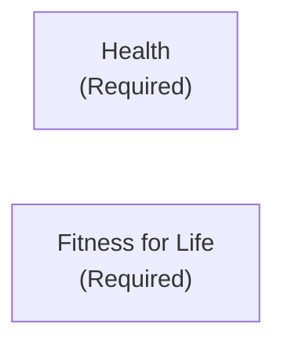

### Health

| | |
|---|---|
| **Graduation Requirement** | Health |
| **Course Length** | Semester |
| **Fee** | Free (Graduation Pathways) |

Covers the entire health triangle: Physical, Mental/Emotional, and Social Health. Students learn CPR and First Aid, nutrition, fitness, disease prevention, stress management, resiliency skills, communication, decision-making, and refusal skills.

### Fitness for Life

| | |
|---|---|
| **Graduation Requirement** | PE Fitness |
| **Course Length** | Semester |
| **Fee** | Free (Graduation Pathways) |

Comprehensive fitness program. Students develop and follow a personal fitness plan, participate in "fitnessgram" testing, and take a written test on fitness principles.

---

## Physical Education Electives

> **Graduation Requirement:** PE electives count toward the 2.0 PE & Health credits (after Fitness for Life and Health are complete, you still need ~1.0 credit of PE electives). Additional PE courses beyond the requirement count as general electives. Some dance courses can count as either Art or PE.

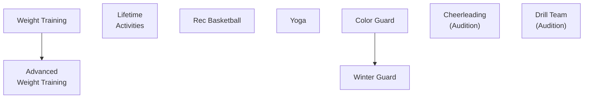

### Lifetime Activities

| | |
|---|---|
| **Graduation Requirement** | PE Elective |
| **Course Length** | Semester |
| **Fee** | $45 + $10 PE Uniform (or own black shirt) |

Students play a sport every day, developing advanced skills, strategies, and knowledge of rules. Includes off-campus activities such as bowling. District "fitnessgram" required.

### Weight Training

| | |
|---|---|
| **Graduation Requirement** | PE Elective |
| **Course Length** | Semester |
| **Fee** | $5 + $10 PE Uniform (or own black shirt) |

Basic knowledge and skills in weight training. Improve muscular strength and endurance and enhance self-image.

### Advanced Weight Training

| | |
|---|---|
| **Graduation Requirement** | PE Elective |
| **Course Length** | Semester |
| **Prerequisite** | Weight Training |
| **Fee** | $5 + $10 PE Uniform (or own black shirt) |

Refining lifting techniques, increasing intensity, and implementing periodized programming. Covers compound lifts (squat, bench, deadlift, cleans), advanced spotting, injury prevention, and personalized goal-driven routines.

### Rec Basketball

| | |
|---|---|
| **Graduation Requirement** | PE Elective |
| **Course Length** | Semester |
| **Fee** | $5 + $10 PE Uniform (or own black shirt) |

Play basketball, learn the rules, and understand the game. Not associated with high school basketball teams — open to all skill levels.

### Yoga

| | |
|---|---|
| **Graduation Requirement** | PE Elective |
| **Course Length** | Semester |
| **Grades** | 10-12 |
| **Fee** | Free (Graduation Pathways) |

Explores various forms of yoga, mindfulness, and meditation skills. Builds strength, flexibility, and body connection.

### Color Guard

| | |
|---|---|
| **Graduation Requirement** | PE Elective / Elective |
| **Course Length** | 1st Semester |
| **Prerequisite** | Audition |
| **Fee** | Participation, Uniform, and Other fees apply |
| **Required** | Dual enrollment in Marching Band |

Spin and perform with flags, rifles, and sabers while developing dance technique, coordination, and performance skills. Performs and competes as part of the marching band in outdoor field shows.

### Winter Guard

| | |
|---|---|
| **Graduation Requirement** | Elective |
| **Course Length** | 2nd Semester |
| **Prerequisite** | Audition |
| **Fee** | Participation, Uniform, and Other fees apply |

Competes independently with a fully choreographed show in an indoor competition circuit.

### Cheerleading (Audition)

| | |
|---|---|
| **Graduation Requirement** | PE Elective |
| **Course Length** | Full year |
| **Prerequisite** | Audition |
| **Fee** | Participation, Uniform and Other fees apply |

### Drill Team (Audition)

| | |
|---|---|
| **Graduation Requirement** | PE Elective |
| **Course Length** | Full year |
| **Prerequisite** | Audition |
| **Fee** | Participation, Uniform and Other fees apply |

Competitive region and state titles. Members support athletic teams, create school spirit, and perform at basketball and football games.

---

## CTE — Agriculture

> **Graduation Requirement:** 1.0 credit of CTE required from any CTE pathway area. Agriculture courses count toward CTE credit. Some CTE courses (like Bio-Ag Science) can also fulfill science core/elective requirements — double-dipping where listed.

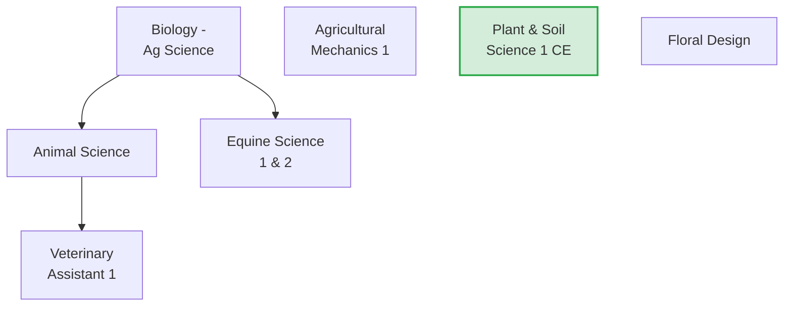

*Agricultural Mechanics 2 & 3 are restricted to grades 11-12 / 12 only.*

### Agricultural Mechanics 1

| | |
|---|---|
| **Graduation Requirement** | CTE |
| **Course Length** | Full year |
| **CTE Pathway** | Agriculture Mechanics Systems |
| **Fee** | $30 |

Basic skills in agricultural mechanical activities: basic welding (Stick and MIG), plumbing, wooden structures, and small gas engines. Emphasis on safety and proper use of tools.

### Veterinary Assistant 1

| | |
|---|---|
| **Graduation Requirement** | CTE |
| **Course Length** | Full year |
| **CTE Pathway** | Animal & Veterinary Science |

Explores veterinary careers. Covers anatomy, physiology, chemistry, animal health and disease, dentistry and laboratory procedures. Hands-on care in surgical assisting, bandaging, wound care, oral care, and general nursing care.

### Floral Design

| | |
|---|---|
| **Graduation Requirement** | CTE |
| **Course Length** | Semester |
| **CTE Pathway** | Plant Science |
| **Fee** | $20 |

Covers principles of floral art with emphasis on commercial design. Topics include design styles, color harmonies, identification and care of cut flowers, mechanical aids, personal flowers, holiday designs, and plant identification.

---

## CTE — Business & Marketing

> **Graduation Requirement:** Any of these courses count toward the 1.0 CTE credit. Digital Business Applications can also fulfill the 0.5 Digital Studies requirement. Semester courses = 0.5 credit.

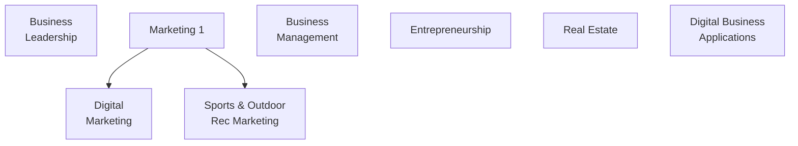

### Business Leadership

| | |
|---|---|
| **Graduation Requirement** | CTE |
| **Course Length** | Semester |
| **CTE Pathway** | Business, Agriculture Mechanics Systems, Hospitality & Tourism, Plant Science, Personal Care Services |

Introduces management theory with focus on communication, problem solving, teamwork, decision making, conflict resolution, and critical analysis.

### Marketing 1

| | |
|---|---|
| **Graduation Requirement** | CTE |
| **Course Length** | Semester |
| **CTE Pathway** | Business, Marketing, Manufacturing & Production, Personal Care Services, Hospitality & Tourism |

Explores basic marketing and advertising concepts. Students create campaigns, participate in group projects, and learn planning, target market identification, research, pricing strategies, and promotion. Students participate in DECA.

### Digital Marketing

| | |
|---|---|
| **Graduation Requirement** | CTE |
| **Course Length** | Semester |
| **CTE Pathway** | Marketing |

Students learn how brands, influencers, and businesses grow online. Covers social media content creation, branding and target audiences, influencer marketing and monetization, digital ads and marketing data, and marketing strategies.

### Business Management

| | |
|---|---|
| **Graduation Requirement** | CTE |
| **Course Length** | Semester |
| **CTE Pathway** | Business |

Teaches how businesses are started, organized, and run. Covers business operations, leadership, decision-making, entrepreneurship, budgets, and case studies.

### Entrepreneurship

| | |
|---|---|
| **Graduation Requirement** | CTE |
| **Course Length** | Semester |
| **CTE Pathway** | Business, Construction, Graphic Design, Hospitality & Tourism, Manufacturing, Marketing, Personal Care Services, Pre-K ECE |

Covers traits of entrepreneurs, starting a small business, innovation, patents, copyrights, entity structuring, financing, marketing, and developing a complete business plan.

### Sports & Outdoor Recreation Marketing

| | |
|---|---|
| **Graduation Requirement** | CTE |
| **Course Length** | Semester |
| **CTE Pathway** | Business, Hospitality & Tourism, Marketing |

Specialized marketing activities in recreation and sporting events: sponsorship, merchandising, integrated marketing campaigns, and promotional activities. Students are introduced to DECA and FBLA.

### Real Estate

| | |
|---|---|
| **Graduation Requirement** | CTE |
| **Course Length** | Semester |
| **CTE Pathway** | Business, Marketing |

Covers scope of the real estate industry, land market forces, property ownership types, contracts, deeds, buying/selling processes, mortgages, financing methods, and advertising/promotional activities.

### Digital Business Applications

| | |
|---|---|
| **Graduation Requirement** | CTE & Digital Studies |
| **Course Length** | Semester |
| **CTE Pathway** | Business, Graphic Design, Hospitality & Tourism, Marketing |

Project-based course exploring business applications through a sales and advertising career lens. Students build a digital portfolio covering business tools, safety/security, communications, and global business applications.

---

## CTE — Family & Consumer Sciences

> **Graduation Requirement:** Any of these courses count toward the 1.0 CTE credit. Semester courses = 0.5 credit.

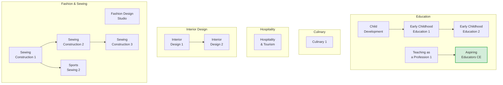

*ECE 3 is grades 11-12 only. ProStart 1 CE and Baking & Pastry are grades 11-12 only.*

### Child Development

| | |
|---|---|
| **Graduation Requirement** | CTE |
| **Course Length** | Semester |
| **CTE Pathway** | Pre-K: Early Childhood Education |

Covers human growth and development from prenatal to school age (0-5 years). Includes physical, mental, emotional, and social growth. Parenting skills, positive guidance techniques, and child-related issues.

### Early Childhood Education 1

| | |
|---|---|
| **Graduation Requirement** | CTE |
| **Course Length** | Semester |
| **Prerequisite** | Child Development |
| **CTE Pathway** | Pre-K: Early Childhood Education |

Prepares for child-related careers through personal interaction with children. Covers developing positive relationships, childcare policies, guidance techniques, and health/safety concerns. Onsite preschool/childcare experience is a major component.

### Early Childhood Education 2

| | |
|---|---|
| **Graduation Requirement** | CTE |
| **Course Length** | Semester |
| **Prerequisite** | Early Childhood Education 1 |
| **CTE Pathway** | Pre-K: Early Childhood Education |

Continuation of ECE 1. Investigate learning years from 3-5. Create hands-on, developmentally appropriate activities to interact with and teach preschool-aged children.

### Teaching as a Profession 1

| | |
|---|---|
| **Graduation Requirement** | CTE |
| **Course Length** | Semester |
| **CTE Pathway** | K-12: Teaching as a Profession |

Covers educational roles and opportunities, learning styles and stages, lesson planning and assessments, and student accommodations. Suggested prerequisite for Aspiring Educators CE.

### Aspiring Educators CE

| | |
|---|---|
| **Graduation Requirement** | CTE |
| **Course Length** | Semester |
| **Suggested Prerequisite** | Teaching as a Profession 1 |
| **CTE Pathway** | K-12: Teaching as a Profession |
| **UVU Concurrent Enrollment** | EDEL 1010 |
| **Fee** | $5/credit tuition |

UVU concurrent enrollment class building on Teaching as a Profession. Students dive deeper through field experiences and hands-on observations.

### Culinary 1

| | |
|---|---|
| **Graduation Requirement** | CTE |
| **Course Length** | Semester |
| **CTE Pathway** | Culinary Arts, Hospitality & Tourism |
| **Fee** | $20 |

Hands-on course covering food safety and sanitation, career exploration, knife skills, equipment use, culinary math, cooking techniques, and preparation of stocks, sauces, and yeast breads. FCCLA leadership opportunities and state skills certification test included. Cooking labs are required.

### Hospitality & Tourism

| | |
|---|---|
| **Graduation Requirement** | CTE |
| **Course Length** | Semester |
| **CTE Pathway** | Hospitality & Tourism |

Covers one of the largest industries in the world: tourism evolution, destination geography, airlines, international travel, car rentals, rail travel, cruising, hospitality industry, tours, and marketing & sales.

### Interior Design 1

| | |
|---|---|
| **Graduation Requirement** | CTE |
| **Course Length** | Semester |
| **CTE Pathway** | Architectural & Interior Design, Construction, Graphic Design |

Introduction to elements and principles of design, color experimentation, furniture arrangement, floor plan evaluation, and basic space-planning strategies. Students take the Interior Design 1 CTE Skills Certification Test.

### Interior Design 2

| | |
|---|---|
| **Graduation Requirement** | CTE |
| **Course Length** | Semester |
| **Recommended Prerequisite** | Interior Design 1 |
| **CTE Pathway** | Architectural & Interior Design |

Deeper dive into architecture, furniture styles, materials, color, textiles, lighting, and space planning through hands-on projects. Students take the Interior Design 2 CTE Skills Certification Test.

### Fashion Design Studio

| | |
|---|---|
| **Graduation Requirement** | CTE |
| **Course Length** | Semester |
| **CTE Pathway** | Fashion Apparel & Textiles |

Explores how fashion shapes culture and self-expression. Covers fundamentals of design, textiles, trend influence, and consumer choices.

### Sewing Construction & Textiles 1

| | |
|---|---|
| **Graduation Requirement** | CTE |
| **Course Length** | Semester |
| **CTE Pathway** | Fashion, Apparel & Textiles |
| **Fee** | $5 |

Learn to use a sewing machine, read patterns, choose fabrics, and solve design problems. Students take the Sewing 1 CTE Skills Certification Test.

### Sewing Construction & Textiles 2

| | |
|---|---|
| **Graduation Requirement** | CTE |
| **Course Length** | Semester |
| **Prerequisite** | Sewing 1 or Sports & Outdoor Design 1 |
| **CTE Pathway** | Fashion, Apparel & Textiles |
| **Fee** | $5 |

Advanced projects, new techniques, different fabrics, serger use, specialty sewing feet and stitches. Students take the Sewing 2 CTE Skills Certification Test.

### Sports Sewing 2 (Sports & Outdoor Design 2)

| | |
|---|---|
| **Graduation Requirement** | CTE |
| **Course Length** | Semester |
| **Prerequisite** | Sewing 1 or Sports & Outdoor Design 1 |
| **CTE Pathway** | Fashion, Apparel & Textiles |
| **Fee** | $5 |

Focus on sportswear and outdoor fabrics — performance materials, activewear details, and functional design. Students take the Sports & Outdoor Design 2 CTE Skills Certification Test.

### Sewing Construction & Textiles 3

| | |
|---|---|
| **Graduation Requirement** | CTE |
| **Course Length** | Semester |
| **Prerequisite** | Sewing 1 & 2, Teacher approval only |
| **CTE Pathway** | Fashion, Apparel & Textiles, Architectural & Interior Design |
| **Fee** | $5 |

Advanced course: apparel design, pattern drafting, alterations, fitting, advanced construction, and entrepreneurship in the apparel business. Students take the Sewing 3 CTE State Test.

---

## CTE — Media & Technology

> **Graduation Requirement:** Any of these courses count toward the 1.0 CTE credit. Computer Programming 1 and Web Development 1 can also fulfill the 0.5 Digital Studies requirement. Computer Programming 1 & 2 CE can additionally count as a Math Elective (with signed opt-out form).

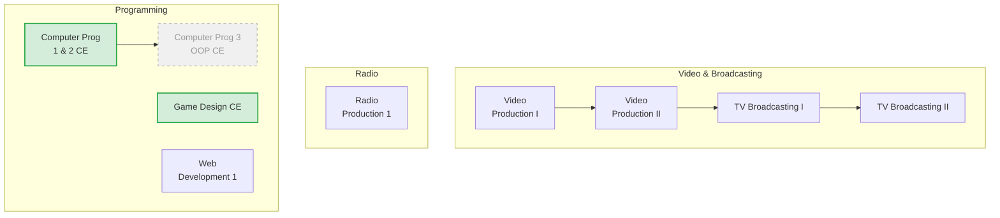

*Computer Programming 3 is grades 11-12 only (shown dashed for planning).*

### Video Production I

| | |
|---|---|
| **Graduation Requirement** | CTE |
| **Course Length** | Semester |
| **CTE Pathway** | Broadcasting & Digital Media |

Hands-on class creating video content for Lehi Television (student-led broadcasting). Students learn video editing, camera techniques, on-air performance, and production teamwork.

### Video Production II

| | |
|---|---|
| **Graduation Requirement** | CTE |
| **Course Length** | Full year or Semester 2 with instructor approval |
| **Prerequisite** | Video Production I |
| **CTE Pathway** | Broadcasting & Digital Media |

Advanced video skills and challenging projects: music videos, films, documentaries. Students take on leadership of Lehi Television. May travel to compete in film festivals.

### TV Broadcasting I

| | |
|---|---|
| **Graduation Requirement** | CTE |
| **Course Length** | Full year |
| **Prerequisite** | Video Production I & II |
| **CTE Pathway** | Broadcasting & Digital Media |

Students lead Lehi Television (LTV), take on the most challenging projects, design shows, build rundowns, create original content, and craft the identity of LTV.

### TV Broadcasting II

| | |
|---|---|
| **Graduation Requirement** | CTE |
| **Course Length** | Full year |
| **Prerequisite** | TV Broadcasting I |
| **CTE Pathway** | Broadcasting & Digital Media |

Continuation for students with 2+ years of video study. Continue growing video and CTE leadership skills. Taught in conjunction with TV Broadcasting I.

### Radio Production 1

| | |
|---|---|
| **Graduation Requirement** | CTE |
| **Course Length** | Full year |
| **CTE Pathway** | Broadcasting & Digital Media |

Basic knowledge and skills in Radio Broadcasting. Students create audio programming for traditional radio, online radio, or podcasting.

### Game Design CE

| | |
|---|---|
| **Graduation Requirement** | CTE |
| **Course Length** | Semester |
| **CTE Pathway** | Programming & Software Development |
| **UVU Concurrent Enrollment** | (available) |
| **Fee** | $5/credit tuition |

Introduces the game development process. By end of course, students can design and create a working video game. Topics include gaming history, development cycle, story/flow creation, perspective, assets, UI, and game mechanics.

### Web Development 1

| | |
|---|---|
| **Graduation Requirement** | Digital Studies or CTE |
| **Course Length** | Semester |
| **CTE Pathway** | Broadcasting & Digital Media, Business, Hospitality & Tourism, Marketing, Programming & Software Development |

Fundamentals of web design and development using HTML, CSS, and JavaScript. Students create responsive, interactive websites while exploring UX principles and accessibility. No prior experience required.

---

## CTE — Health Science

> **Graduation Requirement:** Any of these courses count toward the 1.0 CTE credit. Medical Anatomy & Physiology can also count as a Science Elective. Semester courses = 0.5 credit.

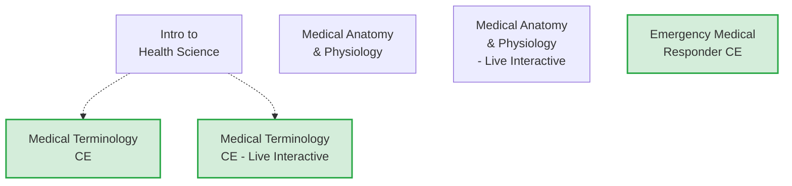

*Sports Medicine CE is grades 11-12 only.*

### Introduction to Health Science

| | |
|---|---|
| **Graduation Requirement** | CTE |
| **Course Length** | Semester |
| **CTE Pathway** | Health Science |

Creates awareness of healthcare career possibilities. Covers introductory anatomy and physiology, medical terminology, medical ethics, first aid, and diseases/disorders. Does NOT count toward a science or health credit.

### Medical Terminology CE

| | |
|---|---|
| **Graduation Requirement** | CTE |
| **Course Length** | Semester |
| **CTE Pathway** | Health Science |
| **UVU Concurrent Enrollment** | HLTH 1300 (3 credits) |
| **Fee** | $5/credit tuition |

Greek- and Latin-based medical language. Emphasis on word roots, suffixes, prefixes, abbreviations, symbols, anatomical terms, and terms associated with body movement. Recommended to take Intro to Health Science first.

### Medical Terminology CE — Live Interactive

| | |
|---|---|
| **Graduation Requirement** | CTE |
| **Course Length** | Semester |
| **CTE Pathway** | Health Science |
| **UVU Concurrent Enrollment** | HLTH 1300 |
| **Fee** | $5/credit tuition |

Same content as Medical Terminology CE. Taught in a facilitator-run classroom with a remote teacher.

### Medical Anatomy & Physiology — Live Interactive

| | |
|---|---|
| **Graduation Requirement** | CTE, Science Elective |
| **Course Length** | Full year |
| **CTE Pathway** | Health Science |

Same content as Medical Anatomy & Physiology (see Science Electives section). Taught in a facilitator-run classroom with a remote teacher.

### Emergency Medical Responder CE

| | |
|---|---|
| **Graduation Requirement** | CTE |
| **Course Length** | Semester |
| **CTE Pathway** | Health Science |
| **UVU Concurrent Enrollment** | HLTH 1200 |
| **Fee** | $5/credit tuition |

Advanced emergency medical information and skills. Introduces career options in emergency medicine. American Red Cross certification available.

---

## CTE — Engineering & Design

> **Graduation Requirement:** Any of these courses count toward the 1.0 CTE credit. Physics and AP Physics courses in the Engineering CTE pathway can fulfill both Science and CTE requirements.

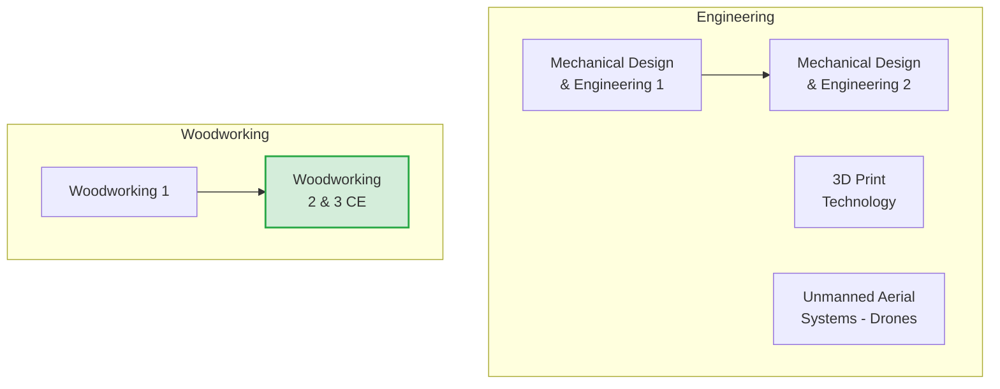

### Mechanical Design & Engineering 1

| | |
|---|---|
| **Graduation Requirement** | CTE |
| **Course Length** | Semester |
| **Grades** | 10-12 |
| **CTE Pathway** | Engineering, Graphic Design, Manufacturing & Production |

Students plan and prepare scale, isometric drawings and technical documentation. Includes standard engineering practices in design and graphics with computer software.

### Mechanical Design & Engineering 2

| | |
|---|---|
| **Graduation Requirement** | CTE |
| **Course Length** | Semester |
| **Grades** | 10-12 |
| **CTE Pathway** | Engineering, Graphic Design |

Students develop 3D models and 2D technical drawings for the mechanical and industrial engineering industry using 3D modeling software.

### 3D Print Technology

| | |
|---|---|
| **Graduation Requirement** | CTE |
| **Course Length** | Semester |
| **Grades** | 10-12 |
| **CTE Pathway** | Broadcasting & Digital Media, Engineering, Programming & Software Development |

Introduction to 3D printing — fundamental principles, technologies, and applications. Hands-on experience with various 3D printing methods; learn to design, prepare, and execute 3D prints.

### Unmanned Aerial Systems — Drones

| | |
|---|---|
| **Graduation Requirement** | CTE |
| **Course Length** | Semester |
| **Grades** | 10-12 |
| **CTE Pathway** | Broadcasting & Digital Media, Engineering, Graphic Design, Architectural & Interior Design, Construction, Agricultural Mechanics |

History, safety, rules and regulations, design and construction of small UAS drones. Students fly both rotary and fixed wing UAS in preparation for certification.

### Woodworking 1

| | |
|---|---|
| **Graduation Requirement** | CTE |
| **Course Length** | Semester |
| **CTE Pathway** | Construction, Engineering, Manufacturing & Production |
| **Fee** | $25 |

Introductory course in millworking. Students build a nightstand in first semester and a small custom project in second semester. Covers safe use of jointer, surfacer, radial arm saw, table saw, band saw, shaper, portable tools, and hand tools.

### Woodworking 2 & 3 CE

| | |
|---|---|
| **Graduation Requirement** | CTE |
| **Course Length** | Full year |
| **Prerequisite** | Woodworking 1 |
| **CTE Pathway** | Manufacturing and Production |
| **UVU Concurrent Enrollment** | CAW 140R |
| **Fee** | $50 + $5/credit tuition |

Advanced furniture design and construction. Projects may include chests of drawers, dressers, tables, entertainment centers, hutches, gun cabinets, cedar chests, and beds.

---

## Digital Studies

> **Graduation Requirement:** 0.5 credits required. Must complete one of: Digital Business Applications, Computer Programming 1, Web Development 1, Computer Science Principles, or Exploring Computer Science. These courses also count toward CTE credit, so you can fulfill two requirements with one course.


*These courses fulfill the Digital Studies graduation requirement. See CTE and Math sections for full descriptions.*

### Computer Programming 1

| | |
|---|---|
| **Graduation Requirement** | CTE, Digital Studies, Math Elective |
| **Course Length** | Semester |
| **Grades** | 10-12 |

Introduces object-oriented programming using Visual Basic.net. Students study classes, methods, fields, data types, control constructs, data I/O, exception handling, and class libraries. (See also Computer Programming 1 & 2 CE under Math Electives for the full-year version with UVU credit.)

---

## General Electives

> **Graduation Requirement:** 9.5 credits of general electives are needed to reach the 28.0 total. Once a core category is completed, any additional courses in that area count as general electives. World Language courses (levels 1-2), additional CTE/Arts/PE courses, and the courses below all count.

```mermaid
graph TD
    AS["Academic Studies"]
    LIA["Latinos in\nAction"]
    SOS["Sources of\nStrength"]
    DC["Digital\nCurriculum"]
    TA["Teacher's Aide"]
    OA["Office Aide"]
    PT["Peer Tutor"]
```

### Academic Studies

| | |
|---|---|
| **Graduation Requirement** | General Elective |
| **Course Length** | Full year or Semester |

Structured environment for homework support, catching up on missed work, and receiving help. Pass/fail based on participation and effort. Students may visit other teachers for missing assignments.

### Latinos in Action (Teacher recommendation only)

| | |
|---|---|
| **Graduation Requirement** | General Elective |
| **Course Length** | Full year |
| **Note** | Only counselors can add with teacher recommendation |

Empowers students through leadership, service, culture, and academics. Students tutor at local elementary schools, visit assisted living centers, support community events, explore careers, visit universities, and host Hispanic Heritage Week.

### Sources of Strength (Teacher recommendation only)

| | |
|---|---|
| **Graduation Requirement** | General Elective |
| **Course Length** | Semester |
| **Note** | Only counselors can add with teacher recommendation |

Based on the nationally recognized Sources of Strength program. Students are trained to identify and amplify Hope, Help, and Strength in the school community. Includes planning and running campaigns and helping at school events.

### Digital Curriculum (Counselor recommendation only)

| | |
|---|---|
| **Graduation Requirement** | General Elective |
| **Course Length** | Full year or Semester |
| **Fee** | East Shore sign up $10/year; classes $5/unit |
| **Note** | Only counselors can add with teacher recommendation |

For making up missed credit from previous classes. Online courses through Canvas Remediation or East Shore Online. Self-paced with facilitators monitoring progress. Pass/fail. Students earn credit for Digital Curriculum AND for classes passed online.

### Teacher's Aide (TA)

| | |
|---|---|
| **Graduation Requirement** | General Elective |
| **Course Length** | Full year or Semester |
| **Note** | Must be approved by teacher; max one aide position per semester |

Aide to an available teacher. Pass/fail based on attendance and attention. Requires written agreement with teacher.

### Office Aide

| | |
|---|---|
| **Graduation Requirement** | General Elective |
| **Course Length** | Full year or Semester |
| **Note** | Must be approved by secretary; max one aide position per semester |

Work in Main Office, Counseling, or Attendance. Learn professionalism, customer service, communication, and organizational skills. Attendance-based.

### Peer Tutor

| | |
|---|---|
| **Graduation Requirement** | General Elective |
| **Course Length** | Full year or Semester |
| **Note** | Must have good attendance |

Help students become aware of various disabilities and interact with students who have disabilities. Peer tutors provide assistance in daily living, social, academic, vocational, and community skills.

---

## Quick Reference: All UVU Concurrent Enrollment Courses for 10th Graders

| Course | UVU Course | Credits | Area |
|--------|-----------|---------|------|
| Biology 1010 CE | BIOL 1010 + BIOL 1015 | 3 + 1 | Science |
| AP Biology 1610 CE | BIOL 1610 + BIOL 1615 | 4 + 1 | Science |
| Chemistry CE | CHEM 1010 + CHEM 1115 | varies | Science |
| AP Environmental Science CE | ENVT 1110 | varies | Science |
| Physics CE | PHYS 1010 | varies | Science |
| Astronomy CE | ASTR 1040 | varies | Science |
| Geology CE | GEO 1010 + GEO 1015 | varies | Science |
| Plant & Soil Science CE | Utah State | varies | Science / CTE |
| Math 1010 CE | MAT 1010 | varies | Math |
| Math 1030 CE | MAT 1030 | varies | Math |
| Math 1040 CE | MAT 1040 | varies | Math |
| Math 1050 CE | MAT 1050 | varies | Math |
| Computer Prog 1 & 2 CE | CS 1400 | varies | Math / CTE |
| AP US History CE | HIST 1700 | 3 | Social Studies |
| Government & Citizenship CE | POLS 1100 | varies | Social Studies |
| Psychology CE | PSY 1010 | varies | Social Studies |
| Art History 1010 CE | ART 1010 | varies | Art / Social Studies |
| Spanish 3 CE | SPAN 1020 | 4 | World Languages |
| Spanish 4 CE | SPAN 2010 | 4 | World Languages |
| French 3 CE | FREN 1020 | 4 | World Languages |
| French 4 CE | FREN 2010 | 4 | World Languages |
| Dance 3 Synergy CE | DANC 141R | varies | Fine Arts |
| Drama 3 CE | THEA 1013 | varies | Fine Arts |
| Music Appreciation CE | varies | varies | Fine Arts |
| Woodworking 2 & 3 CE | CAW 140R | varies | CTE |
| Aspiring Educators CE | EDEL 1010 | varies | CTE |
| Game Design CE | varies | varies | CTE |
| Emergency Medical Responder CE | HLTH 1200 | varies | CTE |
| Medical Terminology CE | HLTH 1300 | 3 | CTE |

> **CE Fee:** All concurrent enrollment classes charge a tuition of $5 per college credit, payable to UVU (e.g., a 3-credit class costs $15).

---

## Smart Scheduling: Courses That Fulfill Multiple Requirements

One of the best strategies for 10th graders is choosing courses that satisfy more than one graduation requirement at the same time, freeing up space for electives or college-credit courses later.

| Course | Requirements Fulfilled | Credits |
|--------|----------------------|:-------:|
| Biology — Agricultural Science | **Science Core** + **CTE** | 1.0 |
| Computer Programming 1 | **Digital Studies** + **CTE** (+ Math Elective with opt-out) | 0.5 |
| Computer Programming 1 & 2 CE | **Digital Studies** + **CTE** + **Math Elective** (with opt-out) + UVU credit | 1.0 |
| Web Development 1 | **Digital Studies** + **CTE** | 0.5 |
| Digital Business Applications | **Digital Studies** + **CTE** | 0.5 |
| Computer Programming 2 | **Science Core** + **CTE** | 0.5 |
| Film Lit 1 / Film Making 1 | **English Elective** or **Fine Arts** | 0.5 |
| Film Lit 2 / Film Making 2 | **English Elective** or **Fine Arts** | 0.5 |
| Art History 1010 CE | **Fine Arts** or **Social Studies Elective** + UVU credit | 0.5 |
| Medical Anatomy & Physiology | **CTE** + **Science Elective** | 1.0 |
| Physics / Physics CE | **Science Core** + **CTE** (Engineering pathway) | 1.0 |
| AP Government & Politics | **Government & Citizenship** + **Social Studies Elective** (full year = both) | 1.0 |
| Dance 1-3 / Dance Company | **Fine Arts** or **PE Elective** | 0.5-1.0 |
| Ballroom 3 / Ballroom Company | **Fine Arts** or **PE Elective** | 1.0 |
| Commercial Art 1 | **Fine Arts** or **CTE** | 0.5 |
| Photography 1-3 | **Fine Arts** or **CTE** | 0.5 each |
| Plant & Soil Science CE | **Science Elective** + **CTE** + Utah State credit | 1.0 |
| Animal Science | **Science Elective** + **CTE** | 1.0 |
| Equine Science | **Science Elective** + **CTE** | 1.0 |

> **Strategy:** A student who takes Digital Business Applications (0.5 cr) knocks out both Digital Studies and starts their CTE requirement in a single semester. Pairing that with Biology-Ag Science (1.0 cr) covers both a Science Core credit and finishes the CTE requirement — fulfilling 3 graduation categories in just 1.5 credits of coursework.

---

## Appendix: Resources & Links

- **Lehi High School Counseling Office** — Schedule appointments, ask questions about course selection, credit checks, and graduation planning:
  [lhs.alpineschools.org/o/lehi-hs/page/counseling](https://lhs.alpineschools.org/o/lehi-hs/page/counseling)

- **Alpine School District Graduation Requirements** — Official district-wide requirements for earning a high school diploma:
  [www.alpineschools.org/page/graduation-requirements](https://www.alpineschools.org/page/graduation-requirements)
